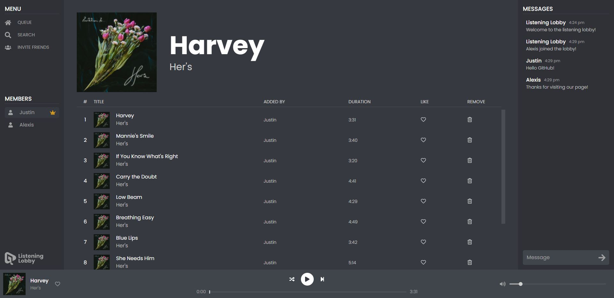
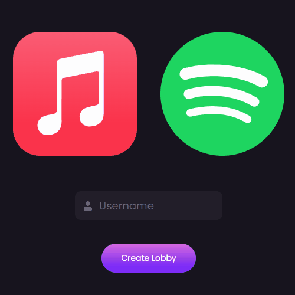

## **Listening Lobby**

Listening Lobby is a web application that allows you to listen to music with friends simultaneously using Spotify or Apple Music in an interactive lobby.

### _Features_

- Provides a way for both Spotify and Apple Music users to listen to music together!

- Our rich yet easy to use lobby system allows users to chat with friends, set/edit the queue, and more.

- Easily add songs to your
  _liked playlist_ from the lobby.

- Extensive search system allows for an easy way to find your favorite songs and artists.

## Table of Contents

- [**Listening Lobby**](#listening-lobby)
  - [_Features_](#features)
- [Table of Contents](#table-of-contents)
- [Usage](#usage)
- [Built With](#built-with)
- [Future Updates](#future-updates)
- [Authors](#authors)
- [Support](#support)

## Usage

1. Start by creating a lobby clicking the _create lobby_ button on the front page.
2. On the create lobby page:

- Click either the Apple or Spotify logo to select your music service.
- Then type in a username of choice.

  

3. Congrats, you've arrived to the lobby! 🎉 Now Lets make our first serach by clicking the search button!
4. Type in a song, artist, or album and **click** the plus sign or **double click** to add it.

   

5. Press play and enjoy the jam! 🎶
6. Lets get some company in here by clicking on the _invite friends_ button, copying the link, and sending it to your friends.

## Built With

- JavaScript
- React
- Express
- Node
- NPM
- HTML
- CSS
- Socket io
- Apple and Spotify api
- Sass

## Future Updates

- [x] Playlist Compatibility - _Easily add songs to your liked playlist from the lobby._
- [ ] Party Mode - _Only admin will need a music provider while other members can set the queue and listen on a centralized device. Perfect for parties._
- [ ] Games - _Create Lobby games that make the listening lobby more interactive and fun. Games will include queue battle royale, guess who queued it and more._
- [ ] QR Code Invites - _Friends can easily join lobby by scanning a qr code_
- [ ] Mobile App

## Authors

**Alexis Martin**

- [GitHub Profile](https://github.com/webdevlex)
- [Personal Website](https://webdevlex.com/)
- [Email: webdeveloperlex@gmail.<area>com ✉️](mailto:webdeveloperlex@gmail.com?subject=Listening-Lobby "webdeveloperlex@gmail.com")
___
**Justin Fisher**

- [GitHub Profile](https://github.com/justinfisherrr)
- [Email: jf.thedeveloper@gmail.<area>com ✉️](mailto:jf.thedeveloper@gmail.com?subject=Listening-Lobby "jf.thedeveloper@gmail.com")
  

## Support

Contributions, issues, and feature requests are welcome!

Give a ⭐️ if you like this project!

[Our Patreon:](https://www.patreon.com/user?u=67023905&fan_landing=true) Please consider supporting us on our Patreon as this project is funded by two college students
